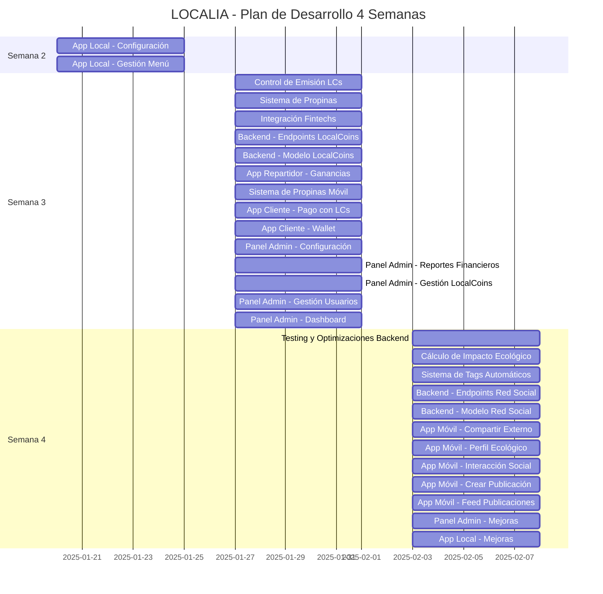

# 📊 Diagrama de Gantt - LOCALIA MVP (4 Semanas)

## 📅 Fechas del Proyecto

### Semana 1: 13/01/2025 - 17/01/2025

### Semana 2: 20/01/2025 - 24/01/2025

#### Dev3

- **#315** App Local - Configuración
- **#314** App Local - Gestión Menú

### Semana 3: 27/01/2025 - 31/01/2025

#### Dev1

- **#320** Control de Emisión LCs
- **#319** Sistema de Propinas
- **#318** Integración Fintechs
- **#317** Backend - Endpoints LocalCoins
- **#316** Backend - Modelo LocalCoins

#### Dev2

- **#324** App Repartidor - Ganancias
- **#323** Sistema de Propinas Móvil
- **#322** App Cliente - Pago con LCs
- **#321** App Cliente - Wallet

#### Dev3

- **#329** Panel Admin - Configuración
- **#328** Panel Admin - Reportes Financieros
- **#327** Panel Admin - Gestión LocalCoins
- **#326** Panel Admin - Gestión Usuarios
- **#325** Panel Admin - Dashboard

### Semana 4: 03/02/2025 - 07/02/2025

#### Dev1

- **#334** Testing y Optimizaciones Backend
- **#333** Cálculo de Impacto Ecológico
- **#332** Sistema de Tags Automáticos
- **#331** Backend - Endpoints Red Social
- **#330** Backend - Modelo Red Social

#### Dev2

- **#339** App Móvil - Compartir Externo
- **#338** App Móvil - Perfil Ecológico
- **#337** App Móvil - Interacción Social
- **#336** App Móvil - Crear Publicación
- **#335** App Móvil - Feed Publicaciones

#### Dev3

- **#341** Panel Admin - Mejoras
- **#340** App Local - Mejoras

## 📈 Diagrama de Gantt (Mermaid)

## 📝 Notas

- Cada semana tiene 5 días laborables (Lunes a Viernes)
- Las tareas están distribuidas entre 3 desarrolladores
- Total: 4 semanas = 20 días laborables
- Horas estimadas: 160h por desarrollador = 480h totales

## 🔗 Enlaces

- [Issues en GitHub](https://github.com/alex9abril/localia-admin/issues)
- [Proyecto en GitHub](https://github.com/users/alex9abril/projects/2)
