# 📊 Diagrama de Gantt Conceptual - LOCALIA MVP

## 🎯 Tareas Principales (10 Tareas)

Este es un Gantt conceptual con las tareas más generales del proyecto, organizadas en 4 semanas.

---

## 📅 Semana 1: Setup y Fundamentos

### Tarea 1: Setup Backend y Base de Datos
**Desarrollador:** Dev1  
**Duración:** 5 días  
**Descripción:** Configuración inicial del backend (NestJS/Express), base de datos PostgreSQL/Supabase, autenticación básica

### Tarea 2: Setup Frontend Móvil
**Desarrollador:** Dev2  
**Duración:** 5 días  
**Descripción:** Configuración React Native, autenticación, navegación básica para App Cliente y App Repartidor

### Tarea 3: Setup Frontend Web
**Desarrollador:** Dev3  
**Duración:** 5 días  
**Descripción:** Configuración Next.js/React, autenticación, layouts para App Local y Panel Admin

---

## 📅 Semana 2: Flujo Core de Pedidos

### Tarea 4: API de Pedidos y Notificaciones
**Desarrollador:** Dev1  
**Duración:** 5 días  
**Descripción:** Endpoints de pedidos, sistema de notificaciones push, geolocalización

### Tarea 5: App Cliente - Pedidos
**Desarrollador:** Dev2  
**Duración:** 5 días  
**Descripción:** Pantallas para ver locales, crear pedidos, seguimiento en tiempo real

### Tarea 6: App Repartidor - Entregas
**Desarrollador:** Dev2  
**Duración:** 5 días  
**Descripción:** Ver pedidos disponibles, aceptar pedidos, gestión de entregas

### Tarea 7: App Local - Gestión de Pedidos
**Desarrollador:** Dev3  
**Duración:** 5 días  
**Descripción:** Dashboard, recepción de pedidos, gestión de menú básica

---

## 📅 Semana 3: Sistema de Créditos

### Tarea 8: Sistema LocalCoins y Fintechs
**Desarrollador:** Dev1  
**Duración:** 5 días  
**Descripción:** Modelo de LocalCoins, integración con fintechs (Stripe/Conekta), sistema de propinas

### Tarea 9: Integración LocalCoins en Apps
**Desarrollador:** Dev2 + Dev3  
**Duración:** 5 días  
**Descripción:** Wallet en App Cliente, pagos con LCs, Panel Admin para gestión de créditos

---

## 📅 Semana 4: Red Social y Testing

### Tarea 10: Red Social Ecológica (MVP) y Testing
**Desarrollador:** Dev1 + Dev2 + Dev3  
**Duración:** 5 días  
**Descripción:** Feed de publicaciones, tags automáticos, compartir impacto, testing end-to-end, documentación

---

## 📊 Diagrama de Gantt (Mermaid)

```mermaid
gantt
    title LOCALIA MVP - Gantt Conceptual (10 Tareas Principales)
    dateFormat YYYY-MM-DD
    section Semana 1
    Setup Backend y Base de Datos (Dev1)     :a1, 2025-01-13, 5d
    Setup Frontend Móvil (Dev2)              :a2, 2025-01-13, 5d
    Setup Frontend Web (Dev3)                :a3, 2025-01-13, 5d
    section Semana 2
    API de Pedidos y Notificaciones (Dev1)  :a4, 2025-01-20, 5d
    App Cliente - Pedidos (Dev2)             :a5, 2025-01-20, 5d
    App Repartidor - Entregas (Dev2)         :a6, 2025-01-20, 5d
    App Local - Gestión Pedidos (Dev3)       :a7, 2025-01-20, 5d
    section Semana 3
    Sistema LocalCoins y Fintechs (Dev1)     :a8, 2025-01-27, 5d
    Integración LocalCoins en Apps (Dev2+3)  :a9, 2025-01-27, 5d
    section Semana 4
    Red Social y Testing (Todos)             :a10, 2025-02-03, 5d
```

---

## 📈 Resumen por Semana

| Semana | Tareas | Desarrolladores | Foco Principal |
|--------|--------|-----------------|---------------|
| **Semana 1** | 3 tareas | Dev1, Dev2, Dev3 | Setup e infraestructura |
| **Semana 2** | 4 tareas | Dev1, Dev2, Dev3 | Flujo core de pedidos |
| **Semana 3** | 2 tareas | Dev1, Dev2, Dev3 | Sistema de créditos |
| **Semana 4** | 1 tarea | Todos | Red social y validación |

---

## 🎯 Entregables por Semana

### Semana 1
- ✅ Backend funcionando con autenticación
- ✅ Apps móviles con login
- ✅ Apps web con login

### Semana 2
- ✅ Cliente puede crear pedido
- ✅ Repartidor puede aceptar y entregar
- ✅ Local puede recibir y gestionar pedidos

### Semana 3
- ✅ Sistema de LocalCoins funcional
- ✅ Pagos con LCs
- ✅ Panel admin operativo

### Semana 4
- ✅ Red social ecológica básica
- ✅ MVP completo end-to-end
- ✅ Testing y documentación

---

## 📅 Fechas del Proyecto

- **Inicio:** 13 de Enero 2025 (Lunes)
- **Fin:** 7 de Febrero 2025 (Viernes)
- **Duración:** 4 semanas (20 días laborables)
- **Horas totales:** 480h (160h por desarrollador)

---

## 💡 Notas

- Este es un Gantt **conceptual** con las tareas más generales
- Cada tarea puede desglosarse en subtareas más específicas
- Las tareas pueden solaparse según necesidades del equipo
- El Proyecto Wallet se desarrollará por separado

---

**Última actualización:** Enero 2025

