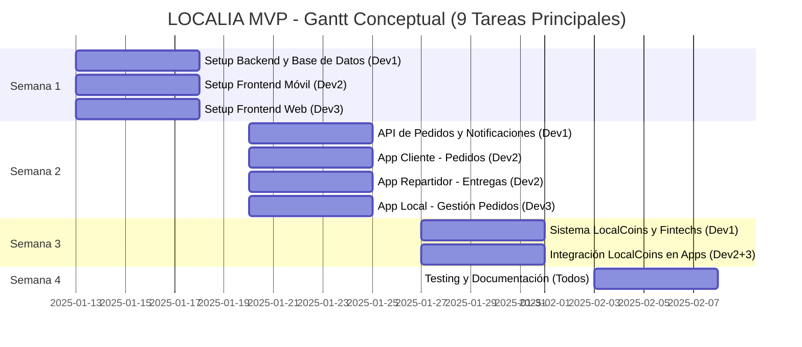

# 📊 Diagrama de Gantt Conceptual - LOCALIA MVP

## 🎯 Tareas Principales del MVP (9 Tareas)

Este es un Gantt conceptual con las tareas esenciales del MVP, organizadas en 4 semanas. **No incluye la red social ecológica** (se desarrollará posteriormente).

---

## 📅 Semana 1: Setup y Fundamentos

### Tarea 1: Setup Backend y Base de Datos
**Desarrollador:** Dev1  
**Duración:** 5 días  
**Descripción:** Configuración inicial del backend (NestJS/Express), base de datos PostgreSQL/Supabase, autenticación básica, estructura de modelos

### Tarea 2: Setup Frontend Móvil
**Desarrollador:** Dev2  
**Duración:** 5 días  
**Descripción:** Configuración React Native, autenticación, navegación básica para App Cliente y App Repartidor

### Tarea 3: Setup Frontend Web
**Desarrollador:** Dev3  
**Duración:** 5 días  
**Descripción:** Configuración Next.js/React, autenticación, layouts para App Local y Panel Admin

---

## 📅 Semana 2: Flujo Core de Pedidos

### Tarea 4: API de Pedidos y Notificaciones
**Desarrollador:** Dev1  
**Duración:** 5 días  
**Descripción:** Endpoints de pedidos (crear, listar, actualizar estado), sistema de notificaciones push, geolocalización y validación de radio (3 km)

### Tarea 5: App Cliente - Pedidos
**Desarrollador:** Dev2  
**Duración:** 5 días  
**Descripción:** Pantallas para ver locales, crear pedidos, seguimiento en tiempo real, historial

### Tarea 6: App Repartidor - Entregas
**Desarrollador:** Dev2  
**Duración:** 5 días  
**Descripción:** Ver pedidos disponibles, aceptar/rechazar pedidos, gestión de entregas, historial

### Tarea 7: App Local - Gestión de Pedidos
**Desarrollador:** Dev3  
**Duración:** 5 días  
**Descripción:** Dashboard, recepción de pedidos, gestión de menú básica, configuración del local

---

## 📅 Semana 3: Sistema de Créditos

### Tarea 8: Sistema LocalCoins y Fintechs
**Desarrollador:** Dev1  
**Duración:** 5 días  
**Descripción:** Modelo de LocalCoins, wallet por usuario, integración con fintechs (Stripe/Conekta/MercadoPago), sistema de propinas, control de emisión

### Tarea 9: Integración LocalCoins en Apps
**Desarrollador:** Dev2 + Dev3  
**Duración:** 5 días  
**Descripción:** Wallet en App Cliente (comprar LCs, pagar con LCs), App Repartidor (ver ganancias), Panel Admin (gestión de créditos, reportes)

---

## 📅 Semana 4: Testing y Refinamiento

### Tarea 10: Testing End-to-End y Documentación
**Desarrollador:** Todos  
**Duración:** 5 días  
**Descripción:** Testing de flujos completos, corrección de bugs, optimización de performance, documentación de usuario, preparación para piloto

---

## 📊 Diagrama de Gantt (Mermaid)

---

## 📈 Resumen por Semana

| Semana | Tareas | Desarrolladores | Foco Principal |
|--------|--------|-----------------|---------------|
| **Semana 1** | 3 tareas | Dev1, Dev2, Dev3 | Setup e infraestructura |
| **Semana 2** | 4 tareas | Dev1, Dev2, Dev3 | Flujo core de pedidos |
| **Semana 3** | 2 tareas | Dev1, Dev2, Dev3 | Sistema de créditos |
| **Semana 4** | 1 tarea | Todos | Testing y validación |

---

## 🎯 Entregables por Semana

### Semana 1: Setup
- ✅ Backend funcionando con autenticación
- ✅ Base de datos configurada
- ✅ Apps móviles con login funcional
- ✅ Apps web con login funcional

### Semana 2: Flujo de Pedidos
- ✅ Cliente puede crear pedido
- ✅ Repartidor puede aceptar y entregar pedido
- ✅ Local puede recibir y gestionar pedidos
- ✅ Notificaciones en tiempo real funcionando

### Semana 3: Sistema de Créditos
- ✅ Sistema de LocalCoins funcional
- ✅ Compra de créditos integrada
- ✅ Pagos con LCs funcionando
- ✅ Sistema de propinas implementado
- ✅ Panel admin operativo

### Semana 4: Validación
- ✅ MVP completo end-to-end
- ✅ Testing de todos los flujos
- ✅ Bugs críticos corregidos
- ✅ Documentación de usuario
- ✅ Preparado para piloto

---

## 📅 Fechas del Proyecto

- **Inicio:** 13 de Enero 2025 (Lunes)
- **Fin:** 7 de Febrero 2025 (Viernes)
- **Duración:** 4 semanas (20 días laborables)
- **Horas totales:** 480h (160h por desarrollador)

---

## 🎯 Criterios de Éxito del MVP

- ✅ Usuario puede crear cuenta y comprar LocalCoins
- ✅ Cliente puede realizar pedido
- ✅ Local puede recibir y gestionar pedido
- ✅ Repartidor puede aceptar y entregar pedido
- ✅ Pagos con LocalCoins funcionan correctamente
- ✅ Notificaciones en tiempo real
- ✅ Panel admin funcional

---

## 💡 Notas

- Este es un Gantt **conceptual** con las tareas más generales del MVP
- Cada tarea puede desglosarse en subtareas más específicas
- Las tareas pueden solaparse según necesidades del equipo
- El **Proyecto Wallet** se desarrollará por separado
- La **Red Social Ecológica** se desarrollará en una fase posterior al MVP

---

**Última actualización:** Enero 2025

