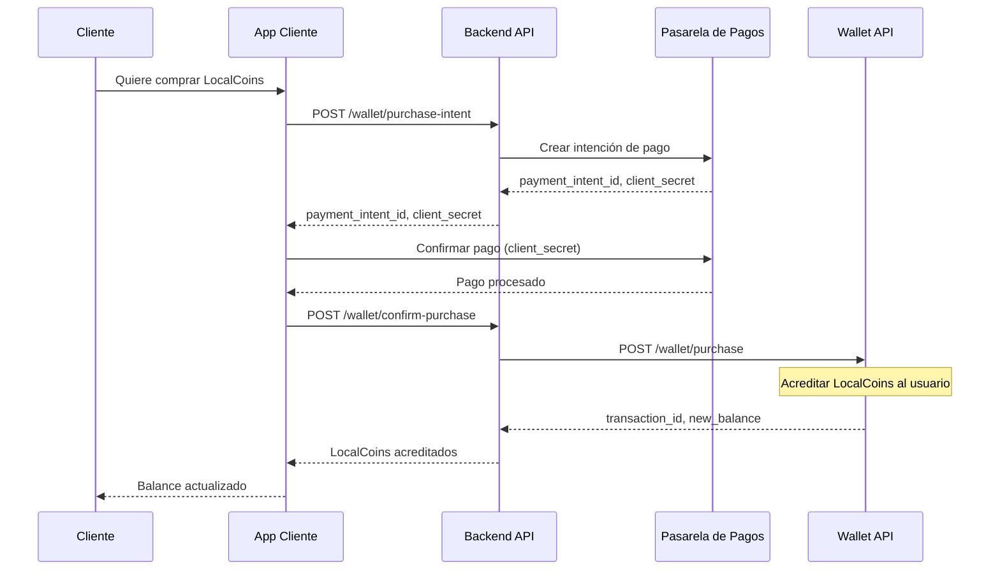

# 🎯 Alcance MVP - LOCALIA Admin

**Versión:** 1.0  
**Fecha:** Enero 2025  
**Audiencia:** Product Owner, Equipo Operativo, Stakeholders

---

## 📋 Resumen Ejecutivo

Este documento define el **alcance mínimo viable (MVP)** del sistema LOCALIA, una plataforma de delivery hiperlocal (radio 3 km) que conecta clientes, negocios locales y repartidores mediante un ecosistema de créditos digitales (LocalCoins).

### Objetivo del MVP

Entregar un sistema funcional end-to-end que permita:
- ✅ Clientes realicen pedidos y paguen con LocalCoins
- ✅ Negocios gestionen menú, reciban y procesen pedidos
- ✅ Repartidores acepten y entreguen pedidos
- ✅ Administradores gestionen el sistema y usuarios
- ✅ Integración con Wallet externo para transacciones financieras
- ✅ Integración con pasarela de pagos para compra de LocalCoins

---

## 👥 Roles y Actores del Sistema

### 1. **Cliente** (`client`)
- Usuario final que realiza pedidos
- Compra LocalCoins para pagar pedidos
- Rastrea entregas en tiempo real
- Deja reseñas y propinas

### 2. **Repartidor** (`repartidor`)
- Acepta/rechaza pedidos disponibles
- Actualiza estado de entregas
- Visualiza ganancias y historial

### 3. **Negocio Local** - Roles de Negocio

#### 3.1. **Superadmin** (`superadmin`)
- Acceso completo al negocio
- Gestiona usuarios y permisos
- Configuración del negocio

#### 3.2. **Admin** (`admin`)
- Gestión completa de productos y precios
- Gestión de promociones
- Gestión de órdenes
- Estadísticas y reportes

#### 3.3. **Operations Staff** (`operations_staff`)
- Panel operativo independiente
- Acepta pedidos (pending → confirmed)
- Actualiza estados (confirmed → preparing → ready)
- Gestiona entregas cuando llega repartidor

#### 3.4. **Kitchen Staff** (`kitchen_staff`)
- Interfaz aislada para cocina
- Solo ve órdenes confirmadas
- Marca órdenes como "en preparación" y "listas"

### 4. **Administrador del Sistema** (`admin`)
- Panel de administración completo
- Gestión de usuarios y negocios
- Métricas y analytics globales
- Configuración del sistema
- Gestión de catálogos y categorías

---

## 🔄 Diagrama de Procesos Principal

### Flujo Completo: Cliente → Local → Repartidor

```mermaid
graph TB
    Start([Cliente inicia sesión]) --> Browse[Explorar negocios disponibles]
    Browse --> Select[Seleccionar negocio y productos]
    Select --> Cart[Agregar al carrito]
    Cart --> Checkout[Proceso de checkout]
    
    Checkout --> Address[Seleccionar dirección de entrega]
    Address --> Delivery[Configurar entrega y propina]
    Delivery --> Payment[Seleccionar método de pago]
    
    Payment --> WalletCheck{¿Tiene LocalCoins<br/>suficientes?}
    WalletCheck -->|No| BuyLC[Comprar LocalCoins<br/>via Pasarela de Pagos]
    BuyLC --> WalletAPI[Wallet API: Acreditar LCs]
    WalletCheck -->|Sí| ProcessPayment[Procesar pago con LCs]
    BuyLC --> ProcessPayment
    
    ProcessPayment --> WalletAPI2[Wallet API: Debitar LCs<br/>del cliente]
    WalletAPI2 --> CreateOrder[Crear pedido<br/>Estado: PENDING]
    
    CreateOrder --> NotifyLocal[Notificar al Local]
    NotifyLocal --> LocalView[Local ve pedido pendiente]
    
    LocalView --> AcceptOrder{¿Acepta pedido?}
    AcceptOrder -->|No| CancelOrder[Cancelar pedido<br/>Estado: CANCELLED]
    CancelOrder --> Refund[Wallet API: Reembolsar LCs]
    Refund --> EndCancel([Fin: Pedido cancelado])
    
    AcceptOrder -->|Sí| ConfirmOrder[Confirmar pedido<br/>Estado: CONFIRMED]
    ConfirmOrder --> NotifyClient[Notificar cliente]
    
    ConfirmOrder --> Kitchen{¿Rol Kitchen Staff?}
    Kitchen -->|Sí| KitchenView[Kitchen ve orden confirmada]
    KitchenView --> StartPrep[Iniciar preparación<br/>Estado: PREPARING]
    StartPrep --> FinishPrep[Terminar preparación<br/>Estado: READY]
    FinishPrep --> ReadyNotify[Notificar: Orden lista]
    
    Kitchen -->|No| OperationsView[Operations ve orden]
    OperationsView --> OperationsPrep[Poner en preparación<br/>Estado: PREPARING]
    OperationsPrep --> OperationsReady[Marcar como listo<br/>Estado: READY]
    
    ReadyNotify --> AssignRepartidor[Asignar a Repartidor]
    OperationsReady --> AssignRepartidor
    
    AssignRepartidor --> RepartidorView[Repartidor ve pedido disponible]
    RepartidorView --> AcceptDelivery{¿Acepta entrega?}
    AcceptDelivery -->|No| WaitRepartidor[Esperar otro repartidor]
    WaitRepartidor --> RepartidorView
    
    AcceptDelivery -->|Sí| PickUp[Recoger pedido<br/>Estado: PICKED_UP]
    PickUp --> InTransit[En camino<br/>Estado: IN_TRANSIT]
    InTransit --> Deliver[Entregar pedido<br/>Estado: DELIVERED]
    
    Deliver --> WalletPayLocal[Wallet API: Pagar al Local]
    Deliver --> WalletPayRepartidor[Wallet API: Pagar al Repartidor]
    Deliver --> WalletPayTip[Wallet API: Pagar propina]
    
    WalletPayLocal --> CompleteOrder[Pedido completado]
    WalletPayRepartidor --> CompleteOrder
    WalletPayTip --> CompleteOrder
    
    CompleteOrder --> Review[Cliente puede dejar reseña]
    Review --> End([Fin: Pedido entregado])
    
    style Start fill:#e1f5ff
    style End fill:#d4edda
    style EndCancel fill:#f8d7da
    style WalletAPI fill:#fff3cd
    style WalletAPI2 fill:#fff3cd
    style WalletPayLocal fill:#fff3cd
    style WalletPayRepartidor fill:#fff3cd
    style WalletPayTip fill:#fff3cd
    style Refund fill:#f8d7da
```



---

## 🏗️ Funcionalidades del MVP

### 📱 **App Cliente (Web)**

#### Autenticación y Perfil
- ✅ Registro e inicio de sesión
- ✅ Gestión de perfil
- ✅ Gestión de direcciones de entrega

#### Catálogo y Pedidos
- ✅ Explorar negocios disponibles (radio 3 km)
- ✅ Ver menú de negocios
- ✅ Agregar productos al carrito
- ✅ Proceso de checkout (3 pasos: dirección, entrega, pago)
- ✅ Selección de método de pago (LocalCoins)
- ✅ Seguimiento de pedidos en tiempo real
- ✅ Historial de pedidos

#### Wallet y Pagos
- ✅ Ver balance de LocalCoins
- ✅ Comprar LocalCoins (integración con pasarela de pagos)
- ✅ Historial de transacciones
- ✅ Pago con LocalCoins en checkout

#### Evaluaciones
- ✅ Dejar reseñas después de entrega
- ✅ Agregar propinas (opcional)

---

### 🏪 **App Local (Web)**

#### Autenticación y Configuración
- ✅ Registro e inicio de sesión
- ✅ Gestión de perfil del negocio
- ✅ Selección de negocio (multi-tienda)

#### Gestión de Productos (Admin/Superadmin)
- ✅ Crear, editar, eliminar productos
- ✅ Gestión de categorías y colecciones
- ✅ Configurar precios y variantes
- ✅ Gestión de impuestos configurables
- ✅ Configurar disponibilidad y horarios

#### Gestión de Órdenes

**Operations Staff:**
- ✅ Panel operativo con vista Kanban
- ✅ Aceptar pedidos (pending → confirmed)
- ✅ Actualizar estados (confirmed → preparing → ready)
- ✅ Gestionar entregas (picked_up → delivered)
- ✅ Cancelar pedidos con razón
- ✅ Notificaciones en tiempo real
- ✅ Auto-refresh cada 5 segundos

**Kitchen Staff:**
- ✅ Interfaz aislada tipo "ticket de cocina"
- ✅ Ver solo órdenes confirmadas y en preparación
- ✅ Marcar como "en preparación" (confirmed → preparing)
- ✅ Marcar como "listo" (preparing → ready)
- ✅ Timer visual de tiempo transcurrido
- ✅ Auto-refresh cada 3 segundos

**Admin/Superadmin:**
- ✅ Vista completa de todas las órdenes
- ✅ Estadísticas y reportes
- ✅ Historial de pedidos

#### Promociones (Admin/Superadmin)
- ✅ Crear y gestionar promociones
- ✅ Descuentos y ofertas especiales

---

### 🚴 **App Repartidor** (Futuro - No en MVP)
- ⏳ Ver pedidos disponibles
- ⏳ Aceptar/rechazar entregas
- ⏳ Actualizar estado de entrega
- ⏳ Navegación y rutas
- ⏳ Visualización de ganancias

> **Nota:** La app repartidor queda para **Fase 2**. En el MVP, los repartidores serán gestionados manualmente o mediante integración futura.

---

### ⚙️ **Panel Admin (Web)**

#### Gestión de Usuarios
- ✅ Ver todos los usuarios
- ✅ Gestionar roles y permisos
- ✅ Activar/desactivar usuarios

#### Gestión de Negocios
- ✅ Ver todos los negocios
- ✅ Aprobar/verificar negocios
- ✅ Gestionar zonas de cobertura

#### Gestión de Catálogos
- ✅ Gestión de categorías de productos
- ✅ Gestión de tipos de impuestos
- ✅ Configuración de catálogos globales

#### Métricas y Analytics
- ✅ Dashboard con métricas globales
- ✅ Reportes de pedidos
- ✅ Estadísticas de usuarios y negocios

#### Configuración del Sistema
- ✅ Gestión de API keys
- ✅ Configuración general
- ✅ Gestión de zonas de servicio

---

## 💳 Integración con Wallet (Proyecto Externo)

### Descripción

El **Wallet** es un proyecto separado que gestiona todas las transacciones financieras con LocalCoins. El MVP se integra mediante **APIs REST**.

### Funcionalidades de Integración MVP

#### 1. **Consulta de Balance**
```
GET /wallet/balance?user_id={userId}
Response: { balance: number, currency: "LC" }
```

#### 2. **Compra de LocalCoins**
```
POST /wallet/purchase
Body: { user_id, amount, payment_method, fintech_transaction_id }
Response: { transaction_id, new_balance }
```

#### 3. **Pago de Pedido**
```
POST /wallet/payment
Body: { from_user_id, to_business_id, amount, order_id }
Response: { transaction_id, status }
```

#### 4. **Pago a Repartidor**
```
POST /wallet/payment
Body: { from_business_id, to_repartidor_id, amount, order_id, type: "delivery_fee" }
Response: { transaction_id, status }
```

#### 5. **Propina**
```
POST /wallet/tip
Body: { from_user_id, to_repartidor_id, amount, order_id }
Response: { transaction_id, status }
```

#### 6. **Reembolso**
```
POST /wallet/refund
Body: { transaction_id, reason, order_id }
Response: { refund_transaction_id, status }
```

#### 7. **Historial de Transacciones**
```
GET /wallet/transactions?user_id={userId}
Response: { transactions: [...] }
```

### Campos de Referencia en Base de Datos

El MVP almacena referencias al Wallet mediante campos `VARCHAR(255)`:
- `user_profiles.wallet_user_id` - ID del usuario en Wallet
- `businesses.wallet_business_id` - ID del negocio en Wallet
- `repartidores.wallet_repartidor_id` - ID del repartidor en Wallet
- `orders.wallet_transaction_id` - ID de transacción de pago
- `tips.wallet_transaction_id` - ID de transacción de propina

---

## 💰 Integración con Pasarela de Pagos

### Descripción

Para comprar LocalCoins, el MVP se integra con una pasarela de pagos (Stripe, Conekta, MercadoPago) que procesa pagos con tarjeta de crédito/débito.

### Flujo de Compra de LocalCoins



### Endpoints MVP

#### 1. **Crear Intención de Compra**
```
POST /wallet/purchase-intent
Body: { user_id, amount_lc, currency: "MXN" }
Response: { payment_intent_id, client_secret, amount_mxn }
```

#### 2. **Confirmar Compra**
```
POST /wallet/confirm-purchase
Body: { payment_intent_id, user_id }
Response: { transaction_id, new_balance, status }
```

#### 3. **Webhook de Pagos** (Callback de Pasarela)
```
POST /webhooks/payment
Body: { event, payment_intent_id, status, ... }
```

---

## 📊 Estados de Pedido en el MVP

| Estado | Descripción | Quién puede cambiar |
|--------|-------------|---------------------|
| `pending` | Pedido creado, esperando confirmación del local | Operations Staff → `confirmed` |
| `confirmed` | Local aceptó el pedido | Operations/Kitchen → `preparing` |
| `preparing` | Orden en preparación | Operations/Kitchen → `ready` |
| `ready` | Orden lista para recoger | Operations → `picked_up` |
| `assigned` | Asignado a repartidor | (Futuro - Fase 2) |
| `picked_up` | Repartidor recogió el pedido | Operations → `in_transit` |
| `in_transit` | En camino a cliente | Operations → `delivered` |
| `delivered` | Entregado al cliente | Sistema automático |
| `cancelled` | Pedido cancelado | Operations/Admin |
| `refunded` | Reembolsado | Sistema automático |

---

## 🎯 Alcance MVP vs Fase 2

### ✅ **INCLUIDO EN MVP**

#### Funcionalidades Core
- ✅ Autenticación y gestión de usuarios
- ✅ Catálogo de productos completo
- ✅ Carrito de compras
- ✅ Proceso de checkout completo
- ✅ Gestión de órdenes end-to-end
- ✅ Roles diferenciados para negocios (superadmin, admin, operations, kitchen)
- ✅ Sistema de impuestos configurable
- ✅ Integración con Wallet (APIs)
- ✅ Integración con pasarela de pagos
- ✅ Notificaciones básicas
- ✅ Panel de administración

#### Apps Incluidas
- ✅ **Web Cliente** - Completa
- ✅ **Web Local** - Completa (con roles diferenciados)
- ✅ **Web Admin** - Completa

---

### ⏳ **EXCLUIDO DEL MVP (Fase 2)**

#### App Repartidor
- ⏳ App móvil/web para repartidores
- ⏳ Sistema de asignación automática de pedidos
- ⏳ Navegación y rutas integradas
- ⏳ Tracking GPS en tiempo real

#### Funcionalidades Avanzadas
- ⏳ Chat en tiempo real (cliente-repartidor-local)
- ⏳ Sistema de membresías Premium
- ⏳ Marketplace y publicidad
- ⏳ Red social ecológica completa
- ⏳ Sistema de referidos
- ⏳ Promociones avanzadas (cashback, bonificaciones)
- ⏳ Suscripciones de negocios
- ⏳ Analytics avanzados y reportes financieros
- ⏳ Sistema de notificaciones push completo
- ⏳ WebSockets para actualizaciones en tiempo real

#### Integraciones Futuras
- ⏳ Integración con múltiples fintechs
- ⏳ Conversión de LCs a dinero real (para locales/repartidores)
- ⏳ Sistema de control de emisión de LCs bonificados
- ⏳ Expansión a múltiples zonas/barrios

---

## 🔐 Seguridad y Validaciones MVP

### Autenticación
- ✅ Supabase Auth para autenticación
- ✅ JWT tokens para sesiones
- ✅ Roles y permisos basados en usuario

### Validaciones de Negocio
- ✅ Radio de cobertura (3 km máximo)
- ✅ Validación de disponibilidad de productos
- ✅ Validación de stock (si se implementa)
- ✅ Validación de horarios de negocio

### Validaciones de Pago
- ✅ Validación de balance de LocalCoins antes de checkout
- ✅ Validación de montos mínimos
- ✅ Verificación de transacciones con Wallet

---

## 📈 Métricas de Éxito del MVP

### Técnicas
- ✅ Tiempo de respuesta de APIs < 500ms
- ✅ Disponibilidad del sistema > 95%
- ✅ Tasa de errores < 1%

### Funcionales
- ✅ Cliente puede completar pedido end-to-end
- ✅ Local puede procesar pedido completo
- ✅ Pagos se procesan correctamente
- ✅ Integración con Wallet funcional
- ✅ Integración con pasarela de pagos funcional

---

## 🚀 Entregables del MVP

### Código
- ✅ Backend API (NestJS) completo
- ✅ Web Cliente (Next.js) completo
- ✅ Web Local (Next.js) completo
- ✅ Web Admin (Next.js) completo
- ✅ Base de datos (PostgreSQL/Supabase) completa

### Documentación
- ✅ Documentación técnica de APIs
- ✅ Documentación de integración con Wallet
- ✅ Documentación de integración con pasarela de pagos
- ✅ Guías de usuario (básicas)

### Testing
- ✅ Testing de flujos principales
- ✅ Testing de integración con Wallet
- ✅ Testing de integración con pasarela de pagos

---

## 📝 Notas Importantes

### Wallet como Proyecto Externo
- El Wallet se desarrolla **por separado** y se integra mediante APIs
- El MVP solo almacena **referencias** (IDs) a entidades del Wallet
- Todas las transacciones financieras se gestionan en el Wallet

### Pasarela de Pagos
- Se integra con **una** pasarela de pagos en el MVP (Stripe, Conekta o MercadoPago)
- La integración permite comprar LocalCoins con tarjeta
- Los webhooks gestionan confirmaciones de pago

### Repartidores en MVP
- Los repartidores se gestionan **manualmente** o mediante integración futura
- No hay app repartidor en el MVP
- Las entregas se pueden marcar manualmente desde el panel de Operations

---

## 🎯 Próximos Pasos Post-MVP

1. **Fase 2.1:** App Repartidor completa
2. **Fase 2.2:** Chat en tiempo real
3. **Fase 2.3:** Red social ecológica
4. **Fase 2.4:** Sistema de membresías Premium
5. **Fase 2.5:** Marketplace y publicidad
6. **Fase 3:** Expansión a múltiples zonas

---

**Documento creado para:** Presentación a Product Owner y Equipo Operativo  
**Última actualización:** Enero 2025  
**Versión:** 1.0

